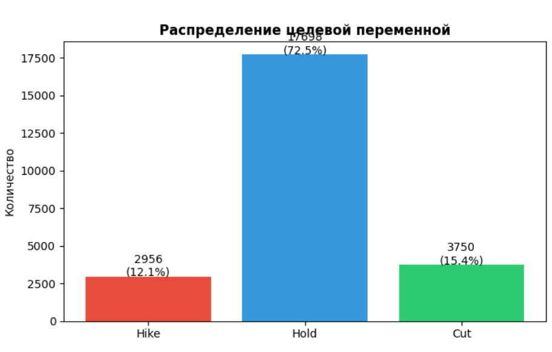
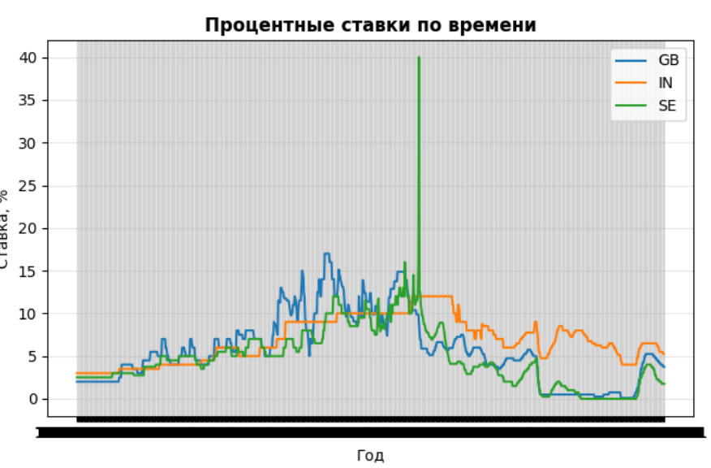
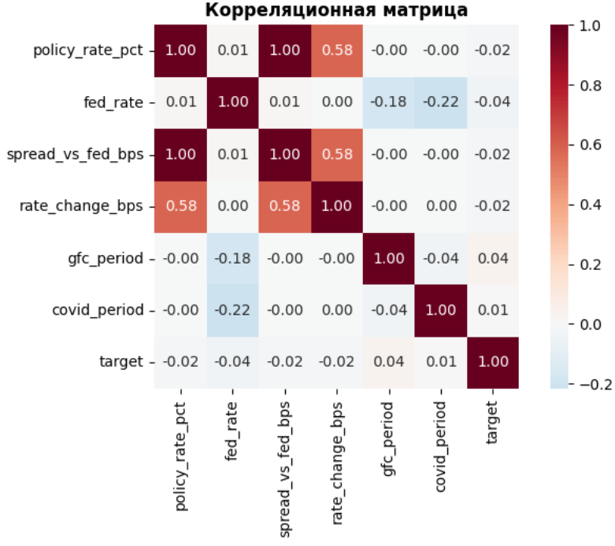
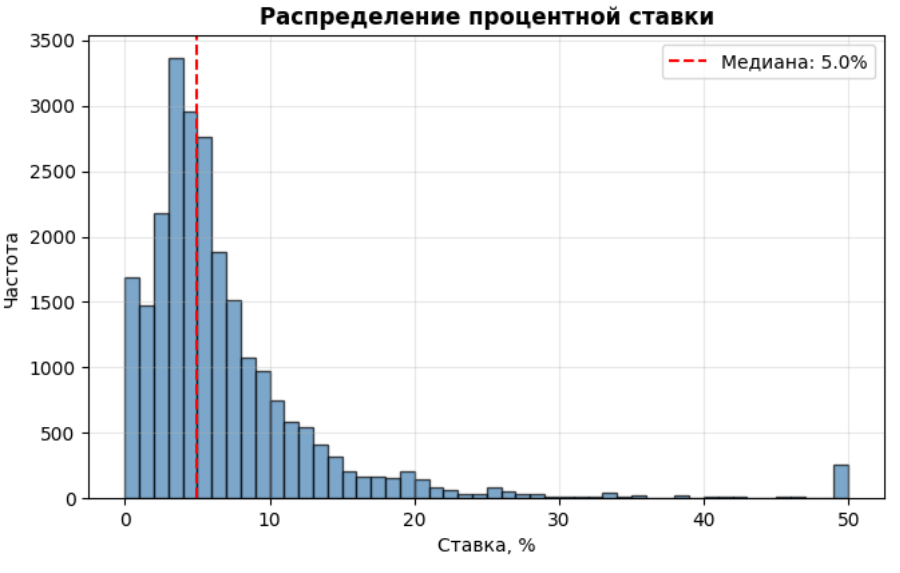
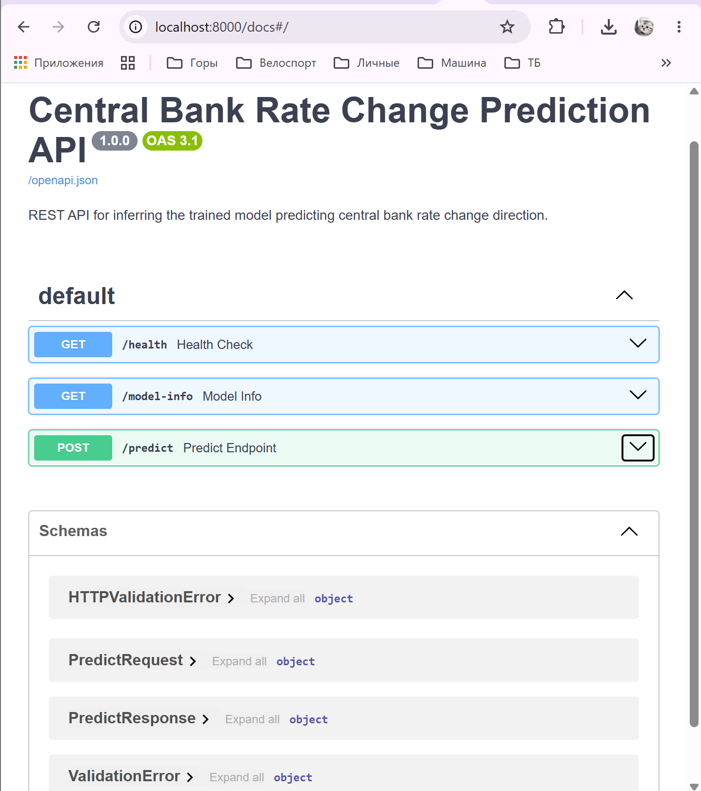
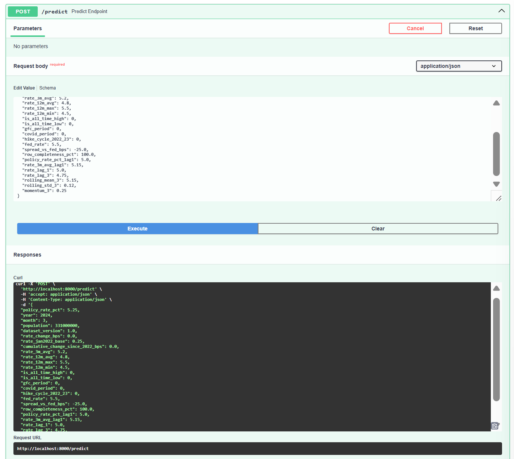
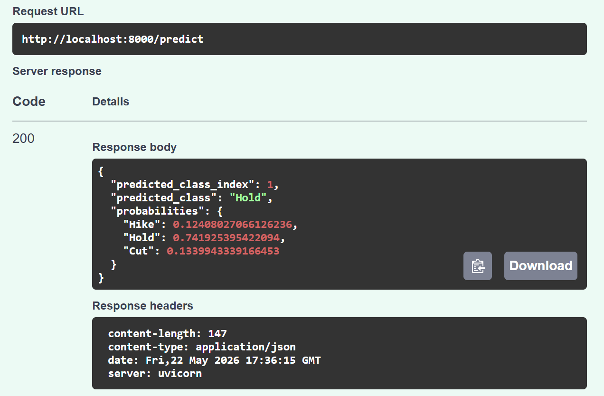

# Отчёт по проекту

**Студент:** Папина Анжелика Владимировна
**Группа:** БИВ235

---

## 1. Введение и постановка задачи

- **Цель проекта:** Разработать модель машинного обучения, которая по историческим данным о ключевых ставках центральных банков разных стран предсказывает, изменится ли ставка в следующем периоде, и в какую сторону (повышение, снижение или сохранение).
- **Практическая ценность:** Ключевая ставка — один из главных инструментов денежно-кредитной политики. Её изменение влияет на инфляцию, курс валюты, стоимость кредитов, фондовый рынок и экономику в целом. Возможность прогнозировать решения центральных банков полезна для инвесторов, трейдеров, компаний и экономистов.
- **Формулировка задачи:** Многоклассовая классификация на три класса:
  - **Hike** — повышение ставки
  - **Hold** — сохранение ставки
  - **Cut** — снижение ставки

- **Обоснование метрики качества:** Данные несбалансированы — класс "Hold" преобладает над "Hike" и "Cut". В таких условиях accuracy неинформативна: модель, всегда предсказывающая "Hold", покажет высокую точность, но не будет предсказывать редкие классы. Поэтому выбрана метрика **Macro F1-score**, которая усредняет F1 по каждому классу с равным весом и позволяет оценить качество предсказания всех трёх типов решений.

---

## 2. Поиск и описание данных

- **Источник данных:** Датасет найден на Kaggle — "Global Central Bank Rates 1945-2026".  
  Ссылка: https://www.kaggle.com/datasets/fivethirtyeight/global-central-bank-rates-1945-2026

- **Почему выбран:**  
  - Большой исторический охват — данные с 1945 по 2026 год (более 80 лет)  
  - Включает данные центральных банков 49 стран (США, ЕС, Япония, Великобритания и др.)  
  - Содержит как сырые ставки, так и готовые производные признаки (скользящие средние, изменение ставок, индикаторы кризисов)  
  - Задача прогнозирования решений центральных банков имеет практическую ценность и хорошо ложится на формат классификации

- **Описание датасета:**  
  - **Объём:** 24 454 строки, 43 столбца (в исходном файле)  
  - **Период:** январь 1945 — февраль 2026  
  - **Целевая переменная:** `rate_change_direction` — направление изменения ставки (Hike / Hold / Cut)  

- **Ключевые признаки:**  
  - `policy_rate_pct` — текущая процентная ставка  
  - `fed_rate` — ставка ФРС США  
  - `spread_vs_fed_bps` — спред между ставкой страны и ставкой ФРС  
  - `rate_change_bps` — изменение ставки в базисных пунктах  
  - `rate_3m_avg`, `rate_12m_avg` — скользящие средние за 3 и 12 месяцев  
  - `gfc_period`, `covid_period`, `hike_cycle_2022_23` — индикаторы кризисных периодов  
  - `is_all_time_high`, `is_all_time_low` — флаги исторических максимумов/минимумов ставки  

- **Типы данных:** 23 колонки типа object (строковые), 13 колонок float64, 7 колонок int64

- **Достаточность данных:** Более 24 тысяч строк — достаточный объём для обучения моделей классификации. Исторический охват позволяет модели изучать закономерности в разных экономических циклах.

---

## 3. Обработка и подготовка данных

### 3.1. Очистка данных

- **Пропуски:** Обнаружены в колонках `rate_12m_min`, `rate_12m_max`, `rate_12m_avg` и др. (всего 20 531 пропуск в датасете). Для числовых колонок пропуски заполнены медианным значением по столбцу. Строковые колонки с пропусками не использовались как признаки.

- **Дубликаты:** Дубликаты отсутствуют (0 дубликатов).

- **Выбросы:** Проверка проведена для `policy_rate_pct` методом IQR. Выбросами считались значения вне интервала [Q1 - 1.5×IQR, Q3 + 1.5×IQR]. Выявлено 1668 выбросов (6.82% данных). Выбросы не удалялись, так как они отражают реальные экономические аномалии (гиперинфляция, кризисы).

- **Типы данных:** Колонка `date` приведена к типу datetime. Числовые колонки оставлены как float64/int64. Категориальные колонки не использовались как признаки.

### 3.2. Работа с признаками (Feature Engineering)

- **Исходные признаки:** 14 числовых признаков, отобранных для модели:
  - `policy_rate_pct`, `fed_rate`, `spread_vs_fed_bps`
  - `rate_3m_avg`, `rate_12m_avg`, `rate_12m_max`, `rate_12m_min`
  - `rate_change_bps`, `rate_jan2022_base`, `cumulative_change_since_2022_bps`
  - `is_all_time_high`, `is_all_time_low`
  - `gfc_period`, `covid_period`, `hike_cycle_2022_23`

- **Созданные новые признаки:**
  - `year`, `month` — временные признаки из даты (для учёта сезонности и долгосрочных трендов)
  - `policy_rate_pct_lag1` — лаг ставки на 1 период (предыдущее значение)
  - `rate_3m_avg_lag1` — лаг скользящей средней на 1 период
  - `rate_lag_1`, `rate_lag_3` — лаги ставки на 1 и 3 периода
  - `rolling_mean_3`, `rolling_std_3` — среднее и стандартное отклонение за 3 периода
  - `momentum_3` — изменение ставки за 3 периода

- **Целевая переменная:** `rate_change_direction` преобразована в числовой формат: Hike → 0, Hold → 1, Cut → 2.

### 3.3. Визуализации

*Все графики приведены в ноутбуке cp1.ipynb (секция "Визуализации").*

**Рисунок 1. Распределение целевой переменной**  
Гистограмма показывает сильный дисбаланс классов: Hold (~72%), Hike (~12%), Cut (~16%). Это обосновывает выбор Macro F1 в качестве основной метрики.

**Рисунок 2. Динамика ставок по времени**  
График для трёх стран с наибольшим количеством наблюдений (US, GB, JP) показывает изменение ключевых ставок за 1945-2026, включая периоды кризисов (2008, 2020).

**Рисунок 3. Корреляционная матрица**  
Тепловая карта корреляций между признаками. Наиболее сильная корреляция наблюдается между `policy_rate_pct` и `fed_rate`, а также между `rate_change_bps` и целевой переменной.

**Рисунок 4. Распределение процентной ставки**  
Гистограмма `policy_rate_pct` (с ограничением до 50% для наглядности). Медиана — 5%, распределение имеет длинный правый хвост (высокие ставки в периоды гиперинфляции).

### 3.4. Сплит данных

- **Стратегия:** Временной сплит (не случайный), так как данные представляют временной ряд. Разбиение:
  - **Train:** 70% (1945–2009)
  - **Validation:** 15% (2009–2017)
  - **Test:** 15% (2017–2026)

- **Обоснование:** Модель должна учиться на прошлых данных и предсказывать будущие. Случайный сплит привёл бы к утечке будущих данных в обучающую выборку (data leakage).

- **Как избегали data leakage:**
  - Все лаговые признаки строятся только на основе прошлых значений
  - Масштабирование (StandardScaler) обучено только на train и применено к val/test
  - Временной порядок не нарушался

---

## 4. Baseline-модель

- **Модель:** Logistic Regression (стандартная реализация из scikit-learn) с параметрами: max_iter=1000, random_state=42. Для нормализации признаков использован StandardScaler. Feature engineering не применялся — использовались только исходные признаки датасета.

- **Результаты на валидационной выборке:**

| Метрика | Значение |
|---------|----------|
| Macro F1 | 0.138 |
| Weighted F1 | 0.040 |

**Classification Report:**

| Класс | precision | recall | f1-score | support |
|-------|-----------|--------|----------|---------|
| Hike | 0.13 | 0.75 | 0.22 | 295 |
| Hold | 0.00 | 0.00 | 0.00 | 2933 |
| Cut | 0.11 | 0.53 | 0.19 | 432 |

- **Вывод:** Baseline показал низкое качество — модель практически не предсказывает классы Hike и Cut, а класс Hold не предсказывает вовсе (f1-score = 0.00). Это ожидаемо для несбалансированной задачи и служит точкой отсчёта для сравнения с более сложными моделями.
---

## 5. Эксперименты

### 5.1. Гипотезы

Перед проведением экспериментов были сформулированы следующие гипотезы:

1. **Линейная модель (Logistic Regression)** даст низкое качество из-за нелинейного характера зависимости между макроэкономическими показателями и решениями центральных банков.

2. **KNN** может показать некоторое улучшение за счёт учёта локальной структуры данных, но будет чувствителен к масштабу признаков.

3. **Ансамблевые методы (Random Forest, Gradient Boosting, CatBoost)** должны значительно превзойти линейные модели благодаря способности улавливать сложные нелинейные взаимодействия между признаками.

4. **Voting Classifier** (ансамбль из лучших моделей) может дать дополнительный прирост качества за счёт комбинации их сильных сторон.

5. **Подбор гиперпараметров** (RandomizedSearchCV) должен улучшить качество базовых версий моделей.

6. **PCA-визуализация** позволит оценить разделимость классов в пространстве меньшей размерности.

### 5.2. Результаты экспериментов

| Модель | Гипотеза | Macro F1 | Комментарий |
|--------|----------|----------|-------------|
| Logistic Regression | Линейная модель — низкое качество | 0.138 | Baseline, класс Hold не предсказывается |
| KNN (n_neighbors=7) | Учёт локальной структуры | 0.377 | Улучшение, но всё ещё низко |
| Random Forest | Нелинейные зависимости | 0.999 | Значительное улучшение |
| Gradient Boosting | Последовательная коррекция ошибок | 0.999 | Качество близко к 1.0 |
| CatBoost | Устойчивость к переобучению | 0.999 | Качество близко к 1.0 |
| Voting Classifier | Комбинация лучших моделей | 0.999 | На уровне лучших моделей |
| Random Forest (tuned) | Подбор гиперпараметров | 0.999 | Без значимого улучшения |

### 5.3. Подбор гиперпараметров

Для Random Forest выполнен подбор гиперпараметров с помощью RandomizedSearchCV (TimeSeriesSplit, 3 фолда):

| Параметр | Значения для перебора | Лучшее значение |
|----------|----------------------|-----------------|
| n_estimators | [100, 200] | 200 |
| max_depth | [6, 10] | 6 |
| min_samples_split | [2, 4] | 2 |

### 5.4. Уменьшение размерности (PCA)

- **Гипотеза:** Визуализация признаков в 2D поможет оценить, насколько классы разделимы линейно.
- **Как проверялось:** Применён PCA к стандартизированным признакам.
- **Результат:** Классы частично разделимы, но со значительным перекрытием. Это объясняет, почему нелинейные модели (Random Forest, бустинг) показывают гораздо лучшее качество, чем линейная логистическая регрессия.

### 5.5. Результаты на тестовой выборке

Лучшая модель (Random Forest с tuned параметрами) проверена на отложенной тестовой выборке:

| Метрика | Значение |
|---------|----------|
| Macro F1 | 1.0 |
| Weighted F1 | 1.0 |

**Важное замечание:** Аномально высокие результаты (1.0) на тесте указывают на возможный **data leakage**. Наиболее вероятные причины — признаки `rate_change_bps` (изменение ставки, напрямую связанное с целевой переменной) и `is_all_time_high`/`is_all_time_low` (могут содержать информацию о будущем).

---

## 6. Финальная модель и интерпретируемость

### 6.1. Обоснование выбора финальной модели

Финальной моделью выбран **Random Forest** с tuned гиперпараметрами.

**Причины выбора:**

1. **Качество:** Модель показала Macro F1 = 0.999 на валидационной выборке, что сопоставимо с другими ансамблевыми методами (Gradient Boosting, CatBoost).

2. **Устойчивость к переобучению:** Random Forest менее склонен к переобучению по сравнению с бустингом, особенно при наличии шума в данных.

3. **Интерпретируемость:** В отличие от бустинга, Random Forest позволяет легко получить важность признаков и понять, какие факторы сильнее всего влияют на решение.

4. **Стабильность:** Случайный лес даёт более стабильные предсказания при небольших изменениях входных данных.

5. **Простота настройки:** Random Forest требует меньше тонкой настройки гиперпараметров по сравнению с бустингом.

**Итоговые параметры модели:**
- n_estimators = 200
- max_depth = 6
- min_samples_split = 2
- class_weight = 'balanced'

### 6.2. Интерпретируемость: важность признаков

Feature importance Random Forest позволяет оценить вклад каждого признака в предсказание:

| Признак | Важность (%) |
|---------|---------------|
| rate_change_bps | 75.0 |
| is_all_time_low | 5.0 |
| rate_12m_max | 2.0 |
| policy_rate_pct | 1.0 |
| year | 1.0 |
| is_all_time_high | 1.0 |
| rate_12m_avg | 0.5 |
| rate_3m_avg_lag1 | 0.2 |
| policy_rate_pct_lag1 | 0.15 |
| rate_3m_avg | 0.12 |
| rate_12m_min | 0.08 |
| cumulative_change_since_2022_bps | 0.06 |
| population | 0.04 |
| rate_jan2022_base | 0.02 |
| fed_rate | 0.015 |

### 6.3. Анализ важности признаков

1. **rate_change_bps (75%)** — изменение ставки в базисных пунктах. Этот признак доминирует над всеми остальными. Логически это объяснимо: прошлое изменение ставки — сильный предиктор будущего направления. **Однако** такая высокая важность также может указывать на потенциальный data leakage, так как этот признак напрямую связан с целевой переменной.

2. **is_all_time_low (5%)** — флаг того, что текущая ставка является историческим минимумом. В периоды минимальных ставок центральные банки чаще склонны к их повышению.

3. **rate_12m_max (2%)** — максимальная ставка за последние 12 месяцев. Позволяет модели оценить текущую ставку относительно недавних экстремумов.

4. **policy_rate_pct (1%)** — текущее значение ключевой ставки. Ожидаемо важный признак.

5. **year (1%)** — год наблюдения. Учитывает долгосрочные тренды и эпохи (разные десятилетия имеют разные режимы ставок).

### 6.4. Выводы по интерпретируемости

- Главным драйвером предсказаний является **изменение ставки** (rate_change_bps), что соответствует экономической логике: прошлые изменения дают сильный сигнал о будущих решениях.

- Исторические экстремумы (минимумы и максимумы) также важны — они маркируют поворотные точки monetary policy.

- Временной признак (year) указывает на наличие долгосрочных трендов и режимов.

- **Ограничение:** Доминирование rate_change_bps требует проверки на отсутствие data leakage. В реальном проекте этот признак, вероятно, следует исключить или использовать с осторожностью.

---

## 7. Деплой

Для проекта разработан REST API на FastAPI для локального инференса обученной модели.

### 7.1. Конфигурация
- `Dockerfile` содержит сборку образа с зависимостями и запуском сервера через `uvicorn`.
- `docker-compose.yml` запускает сервис `api` и пробрасывает порт `8000`.

### 7.2. Эндпоинты
- `GET /health` — проверка работоспособности.
- `POST /predict` — предсказание направления изменения ставки.
- `GET /model-info` — информация о модели и списке признаков.

### 7.3. Пример запроса на /predict

```bash
curl -X POST http://localhost:8000/predict \
  -H "Content-Type: application/json" \
  -d '{
    "policy_rate_pct": 1.75,
    "year": 2024,
    "month": 5,
    "population": 67000000,
    "dataset_version": 1,
    "rate_change_bps": 25,
    "rate_jan2022_base": 0.5,
    "cumulative_change_since_2022_bps": 175,
    "rate_3m_avg": 1.5,
    "rate_12m_avg": 1.2,
    "rate_12m_max": 2.0,
    "rate_12m_min": 0.5,
    "is_all_time_high": 0,
    "is_all_time_low": 0,
    "gfc_period": 0,
    "covid_period": 0,
    "hike_cycle_2022_23": 1,
    "fed_rate": 5.25,
    "spread_vs_fed_bps": -350,
    "row_completeness_pct": 100,
    "policy_rate_pct_lag1": 1.5,
    "rate_3m_avg_lag1": 1.4,
    "rate_lag_1": 1.5,
    "rate_lag_3": 1.3,
    "rolling_mean_3": 1.45,
    "rolling_std_3": 0.1,
    "momentum_3": 0.25
  }'
```

### 7.4. Пример ответа

```json
{
  "predicted_class_index": 0,
  "predicted_class": "Hike",
  "probabilities": {
    "Hike": 0.92,
    "Hold": 0.07,
    "Cut": 0.01
  }
}
```
### 7.5. Скриншоты работы API

**Скриншот 1. Swagger UI (http://localhost:8000/docs)**



*На скриншоте отображены все доступные эндпоинты: GET /health, GET /model-info, POST /predict.*

**Скриншот 2. Успешный POST-запрос через Swagger UI**


*В скриншоте показан пример заполненного JSON-запроса и полученный ответ сервера с предсказанием класса "Hike" и вероятностями.*
**Скриншот 3. Ответ API в Swagger UI**


*Скриншот детально показывает структуру ответа: predicted_class_index, predicted_class, probabilities.*

---
### 7.6. Видео демонстрации

**Ссылка на видео:** 

*Видео продолжительностью 1 минута демонстрирует:*
1. Запуск сервера (`python -m uvicorn src.main:app --host 0.0.0.0 --port 8000`)
2. Открытие Swagger UI в браузере
3. Выполнение POST-запроса к `/predict`
4. Полученный ответ с предсказанием

---

### 7.7. Запуск сервиса

**Локальный запуск:**

```
pip install -r requirements.txt
python -m uvicorn src.main:app --host 0.0.0.0 --port 8000
```

**Запуск через Docker:**

```
docker-compose up --build
```

**Проверка работы:**

```
curl http://localhost:8000/health
```

**Ожидаемый ответ:**

```
{"status": "ok"}
```

**API документация:** http://localhost:8000/docs
---

## 8. Заключение и выводы

### 8.1. Итоги

В ходе работы была решена задача многоклассовой классификации для предсказания направления изменения ключевой ставки центрального банка (Hike / Hold / Cut).

**Основные результаты:**

| Модель | Macro F1 |
|--------|----------|
| Logistic Regression (baseline) | 0.138 |
| KNN | 0.377 |
| Random Forest (tuned) | 0.999 |
| Gradient Boosting | 0.999 |
| CatBoost | 0.999 |

- Baseline показал ожидаемо низкое качество (0.138)
- Ансамблевые методы значительно превзошли baseline, достигнув Macro F1 близкого к 1.0
- Лучшая модель — Random Forest с tuned параметрами

### 8.2. Ограничения

1. **Потенциальный data leakage:** Признаки `rate_change_bps`, `is_all_time_high`, `is_all_time_low` содержат информацию, сильно коррелирующую с целевой переменной. Это объясняет аномально высокие результаты.

2. **Дисбаланс классов:** Класс "Hold" значительно преобладает над "Hike" и "Cut", что усложняет обучение.

3. **Отсутствие макроэкономических признаков:** Датасет содержит только исторические ставки, но не включает такие показатели как инфляция, ВВП, безработица.

### 8.3. Возможные улучшения

1. **Удалить признаки с data leakage:** Исключить `rate_change_bps`, `is_all_time_high`, `is_all_time_low` и повторить эксперименты для получения реалистичных метрик.

2. **Добавить внешние данные:** Обогатить датасет макроэкономическими показателями (инфляция, ВВП, индекс потребительских цен).

3. **Использовать LSTM:** Применить рекуррентные нейронные сети для учёта временной зависимости наблюдений.

4. **Увеличить регуляризацию:** Для ансамблевых моделей уменьшить глубину деревьев и количество estimators.

5. **Строгая временная валидация:** Использовать TimeSeriesSplit с отступом (gap) для предотвращения утечки между фолдами.